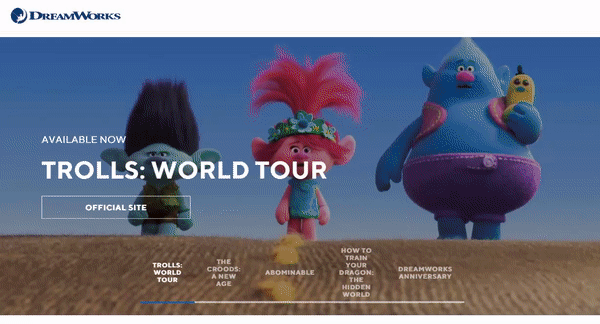
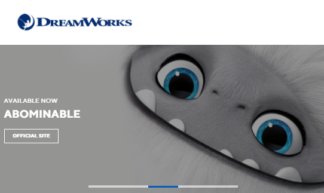
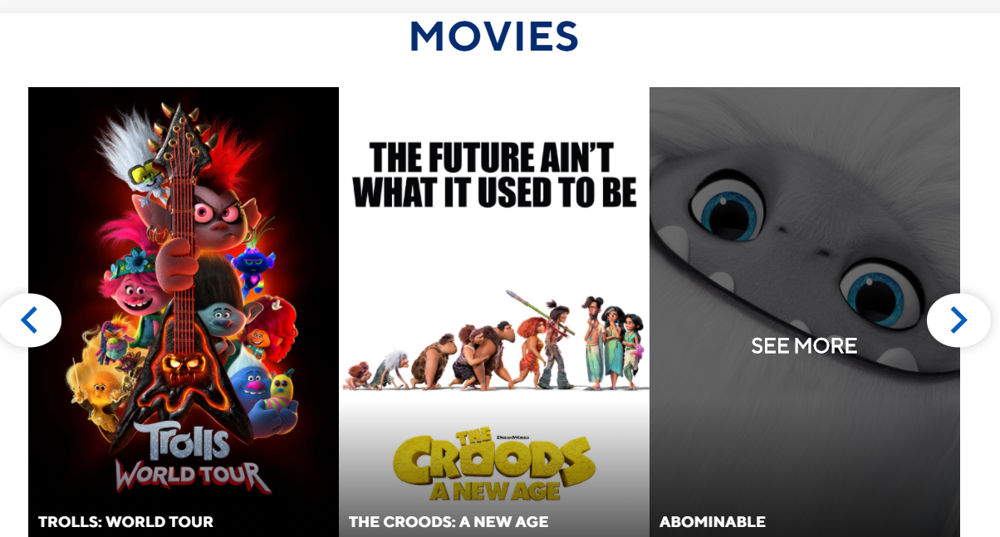
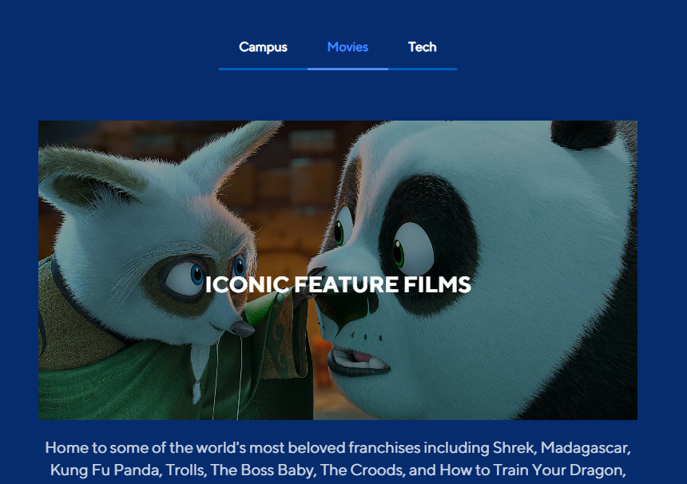
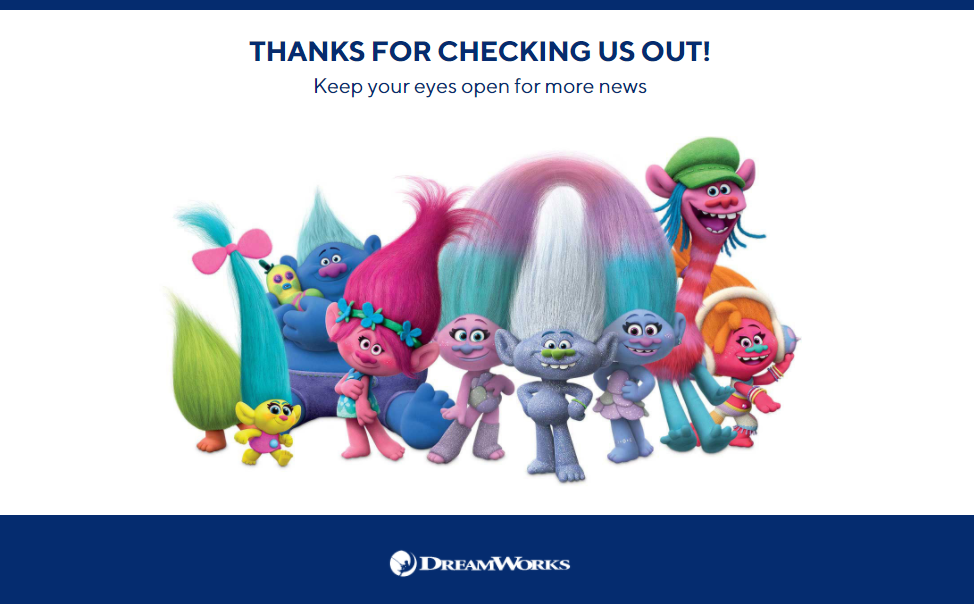
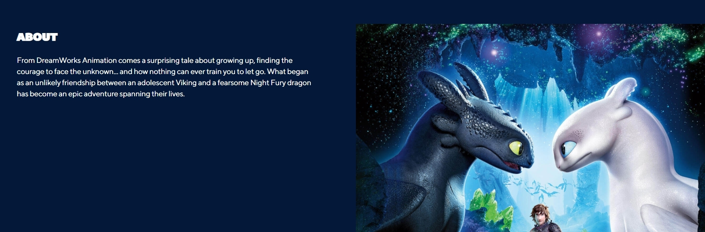
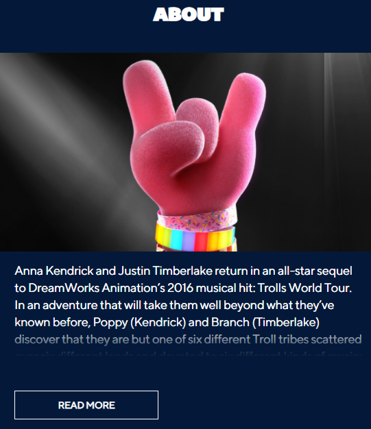

# Dreamworks

Shows Dreamwork movies and their information. Data is stored on PostgreSQL. Developed with React, Redux, Express, Typescript, Jest, React-Testing-Library, JS, HTML, CSS.

# Why I Built It And What I've Learned:

-   To understand the applications and usage of RDBMS.
-   Concepts in a RDBMS (eg; Relationships, Constraints, Queries, etc )
-   How PostgreSQL and the front-end can be integrated.

## PostgreSQL:

### Concepts that were used when building the project:

-   Basic SQL Queries (eg; Select, Aggregate functions, etc), Sub Queries.
-   Database Design and Normalization.
-   Foreign Keys, Primary Keys.
-   JOINS.
-   Views.
-   ACID Transactions for DML (Data Manipulation Language) queries.
-   Backup and Recovery (i.e pg_dump and pg_restore).
-   Roles.

#### Concepts that were INTRODUCED but not applied in the project:

-   Indexing for better performance/speed.
-   Composites to create a custom data type.
-   Sequences to generate a sequence of integers; used commonly with the attributes of a table.
-   SQL Functions (Cannot change database via DML; must return a value).
-   Stored Procedures (Can change database; does NOT have to return value).
-   Triggers are functions that are invoked automatically after a certain event occurs (eg; After an insert, delete statement, etc).
-   Conditional statements that are used in a query (CASE WHEN, COALESCE, NULLIF).
-   CTE (Common Table Expression) queries to create a temporary table so that the table can be referenced with another query statement.

## React:

-   Used Lazy Loading

## Note On Production Site:

-   In this project, our hosting site (Vercel) needs CORS (Cross-origin resource sharing) enabled for the API to be accessed. Thus, other sources could use the API; which isn't ideal for the API's security/privacy.

## External Resources:

-   pgAdmin 4 for PostgreSQL GUI.
-   Postman to test API requests.
-   Prettier to format code and EsLint for linting.
-   Redux dev tool google chrome extension to check the values of the states.

## What It Looks Like












# Getting Started

These instructions will get you a copy of the project up and running on your local machine for development and testing purposes.

1. Clone the project. Use `npm install` to install all the dependencies. Go to the client directory, run the project with `npm start` for development or `npm run build` for production.

2. OPTIONAL: If you want to make changes locally, on the terminal, go to the `backend` directory. Type `npm run convert` to start the local server. The command would also listen to changes and convert the Express Typescript files to Express Javascript files that will be used for production. Create your own local database by restoring the pg_dump file of the dreamworks database given (called 'dreamworks_backup' in root directory). Configure your own Pool settings in databasePool.

# Prerequisites

What things you need to install the software

```
- Any package manager (npm, yarn)
```

# Versioning

None
